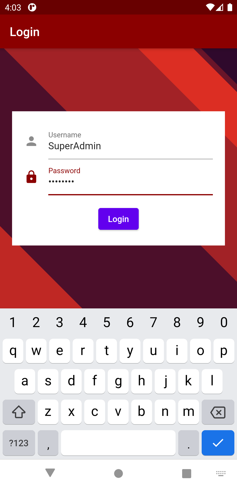
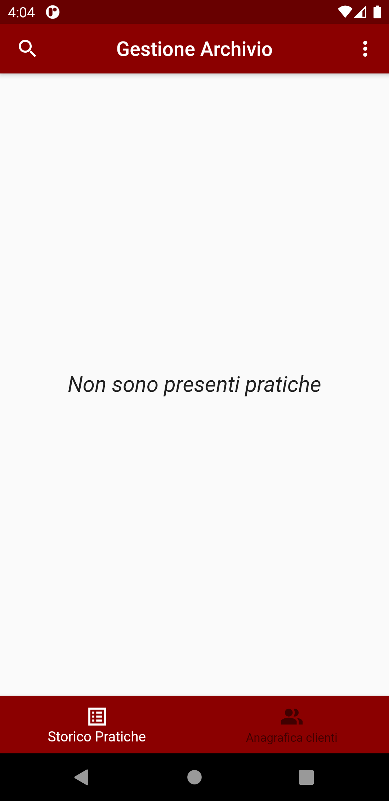
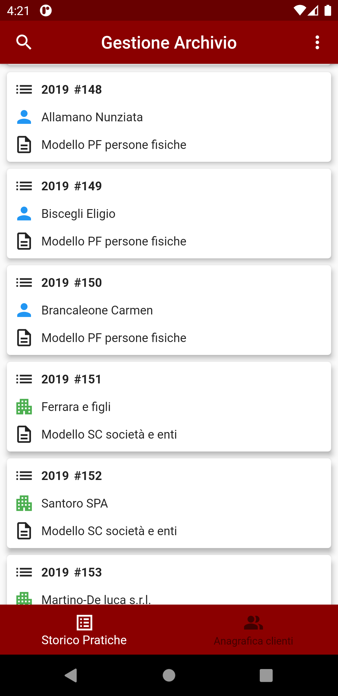
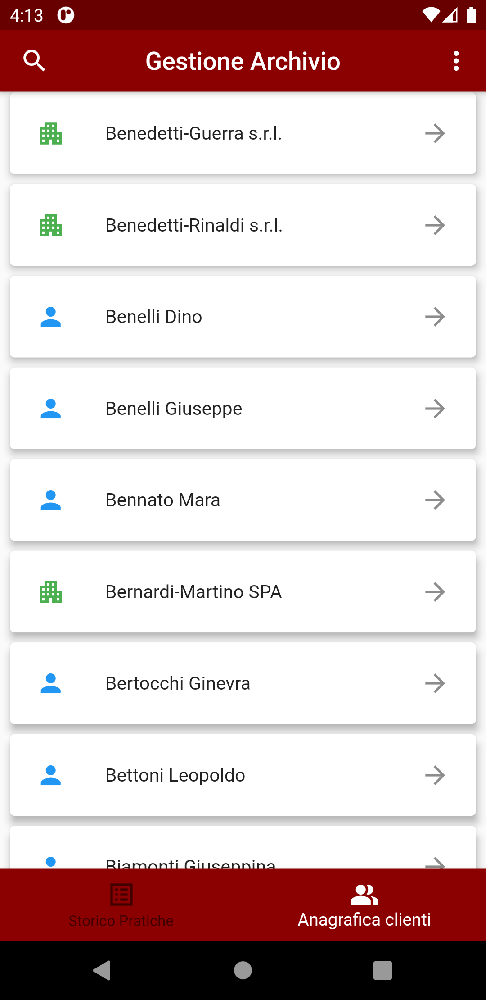

**Luca Cinti, 305772**

# Gestione Archivio

**Presentazione della problematica e scopo dell'applicazione**

Quest'applicazione vuole rispondere ad un problema, che mi è capitato più volte di affrontare, degli studi dei commercialisti per i quali ho lavorato come consulente: *la gestione dell'archivio delle pratiche*.
Ogni commercialista è legalmente tenuto a mantenere per almeno dieci anni uno storico dei lavori svolti per i propri clienti; va da sé come questo comporti l'accumulo di una grande mole di documenti cartacei, che necessariamente ne richiede una catalogazione oculata, nell'ottica di ottimizzare i tempi di ricerca della documentazione stessa.

Negli anni ho gradualmente perfezionato un approccio all'archiviazione così struttuato:
  * La documentazione viene raggruppata in raccoglitori cartacei, divisi per cliente e tipologia di servizio (ad esempio stesura della contabilità, dichiarazione IVA, ecc...);
  * Ad ognuno di questi raccoglitori viene associato un numero progressivo e l'anno di pertinenza della prestazione professionale;
  * I raccoglitori sono a loro volta raggrupati in faldoni che vengono conservati in un magazzino;

Per risalire alla singola pratica, ho sviluppato una semplice applicazione desktop (.NET, Windows Forms) collegata ad un database SQLServer, che permettesse l'inserimento, la modifica e la consultazione dell'archivio.
Non mi addentrerò nei dettagli di questo software, in quanto saranno quasi del tutto ripresi nella nuova applicazione mobile.

Rimaneva così irrisolto un problema: il recupero dei vecchi documenti era reso scomodo e macchinoso dal fatto che i magazzini si trovano quasi esclusivamente in sedi distaccate dal luogo di lavoro.

L'utilizzo di un applicativo mobile risponde dunque puntualmente a quest'ultima necessità.

**Casi d'uso**

Lo scenario tipico si presenta come segue:
  * Vengono inserite nel database dell'archivio delle nuove pratiche, nella modalità sopra descritta;
  * L'utente che ha effettuato l'inserimento può segnalare la presenza di nuovi record, che viene notificata all'applicazione mobile;
  * Vengono sincronizzati i dati tra server e client;
  * L'utente ha a disposizione l'applicativo pronto per la consultazione dell'archivio, senza doversi interfacciare con il personale dell'ufficio.
  
# Utilizzo dell'applicazione

Al primo avvio viene richiesto all'utente di effettuare il login.
Le credenziali di test sono user: SuperAdmin, pass: Penna789:

L'utente loggato potrà successivamente accedere all'applicazione senza reinserire le credenziali, in quanto sono salvate sul dispositivo.

Una volta effettuato il login, all'utente si presenterà l'home page con tutte le sue componenti:

In basso troviamo una BottomNavigationBar dalla quale è possibile navigare tra le due pagine relative alla consultazione delle pratiche e dei clienti.
In alto invece l'AppBar con il nome dell'applicazione, una SearchBar nella quale applicare filtri di ricerca tra i record, e un PopupMenuItem dal quale è possibile effettuare il logout e la sincronizzazione dei dati col server.

 
Cliccando su *Aggiorna dati* una chiamata http recupererà i dati dal server in formato JSON, andandoli a scrivere localmente sul database sqlite nel dispositivo.
L'interfaccia si presenterà come segue:

  
   

L'utente potrà a questo punto consultare l'archivio semplicemente scorrendo le due pagine, oppure, molto più comodamente, utilizzando i filtri dedicati, che effettuano la ricerca tra tutti i campi di testo visualizzati a schermo, come possiamo vedere nell'esempio:

