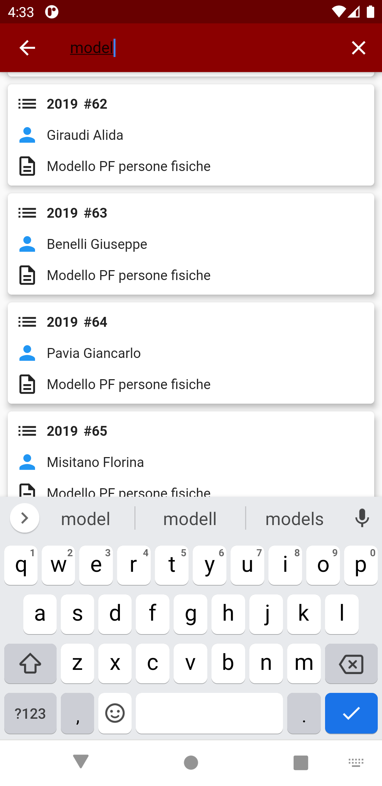

**Luca Cinti, 305772**

# Gestione Archivio

**Presentazione della problematica e scopo dell'applicazione:**

Quest'applicazione vuole rispondere ad un problema degli studi dei commercialisti, per i quali abbiamo lavorato come consulenti: *la gestione dell'archivio delle pratiche*.

Ogni commercialista è infatti legalmente tenuto a mantenere per almeno dieci anni uno storico dei lavori svolti per i propri clienti; va da sé come questo comporti l'accumulo di una grande mole di documenti cartacei, che necessariamente ne richiede una catalogazione oculata, nell'ottica di ottimizzare i tempi di ricerca della documentazione stessa.

Negli anni è stato gradualmente perfezionato un approccio all'archiviazione così struttuato:
  * La documentazione viene raggruppata in raccoglitori cartacei, divisi per cliente e tipologia di servizio (ad esempio stesura della contabilità, dichiarazione IVA, ecc...);
  * Ad ognuno di questi raccoglitori viene associato un numero progressivo e l'anno di pertinenza della prestazione professionale;
  * I raccoglitori sono a loro volta raggrupati in faldoni che vengono conservati in un magazzino;

Per risalire alla singola pratica, è stata sviluppata una semplice applicazione desktop (.NET, Windows Forms) collegata ad un database SQLServer, che permette l'inserimento, la modifica e la consultazione dell'archivio.
Non ci addentreremo nei dettagli di questo software, in quanto saranno quasi del tutto ripresi nella nuova applicazione mobile.

Rimaneva così irrisolto un problema: il recupero dei vecchi documenti era reso scomodo e macchinoso dal fatto che i magazzini si trovano quasi esclusivamente in sedi distaccate dal luogo di lavoro.

L'utilizzo di un applicativo mobile risponde dunque puntualmente a quest'ultima necessità.

**Casi d'uso:**

Lo scenario tipico si presenta come segue:
  * Vengono inserite nel database dell'archivio delle nuove pratiche, nella modalità sopra descritta;
  * L'utente che ha effettuato l'inserimento può segnalare la presenza di nuovi record, che viene notificata all'applicazione mobile;
  * Vengono sincronizzati i dati tra server e client;
  * L'utente ha a disposizione l'applicativo pronto per la consultazione dell'archivio, senza doversi interfacciare con il personale dell'ufficio.
  
# Utilizzo dell'applicazione

Al primo avvio viene richiesto all'utente di effettuare il login.
Le credenziali di test sono user: SuperAdmin, pass: Penna789:

L'utente loggato potrà successivamente accedere all'applicazione senza reinserire le credenziali, in quanto sono salvate sul dispositivo.

Una volta effettuato il login, all'utente si presenterà l'home page con tutte le sue componenti:

In basso troviamo una *BottomNavigationBar* dalla quale è possibile navigare tra le due pagine relative alla consultazione delle pratiche e dei clienti.
In alto si trovano invece l'*AppBar* con il nome dell'applicazione, una *SearchBar* nella quale applicare filtri di ricerca tra i record, e un *PopupMenuItem* dal quale è possibile effettuare il logout e la sincronizzazione dei dati col server.

 
Cliccando su *Aggiorna dati* una chiamata http recupererà i dati dal server in formato JSON, andandoli a scrivere localmente sul database sqlite nel dispositivo.
L'interfaccia si presenterà come segue:

  
   

L'utente potrà a questo punto consultare l'archivio semplicemente scorrendo le due pagine, oppure, molto più comodamente, utilizzando i filtri dedicati, che effettuano la ricerca tra tutti i campi di testo visualizzati a schermo, come possiamo vedere negli esempi che seguono:

  
   

Come si nota dall'immagine di destra, quando si è in visualizzazione filtrata, compare l'icona del filtro che, se cliccata, rimuove i filtri presenti restituendo la visualizzazione originale.

Tra le funzionalità più utili dell'applicativo, vi è la possibilità di risalire allo storico di tutte le pratiche relative ad un cliente, semplicemente cliccando sulla relativa card:

 
**Aggiornamento dei dati**

Ogniqualvolta verranno inseriti dei nuovi record, o effettuate modifiche ai dati nell'applicativo desktop, l'utente avrà facoltà di inviare una notifica a tutti i dispositivi in cui è installata l'applicazione mobile. Al click sulla notifica in automatico i dati verranno sincronizzati in modalità DELETE-INSERT, ovvero cancellando tutti i dati del database locale, e inserendo i nuovi record.

  
   

A sinistra possiamo vedere la ricezione della notifica, mentre a destra l'interfaccia durante l'aggiornamento dei dati.

È possibile ovviamente utilizzare l'applicazione sia in *portrait* che in *landscape mode*: le interfacce sono modificate per meglio adattarsi alle due modalità:

# Cenni sul modello dati

Per semplificare e snellire il funzionamento dell'applicativo mobile, i dati con esso sincronizzati sono esportati a partire da due semplici *viste* sul database di produzione.
Il modello dati è (molto grossolanamente) riportato nell'immagine che segue, dove si possono anche vedere gli script di creazione delle *viste* di cui sopra:

 
Come nota a margine facciamo osservare che è stato scelto di non permettere modifiche ai dati lato applicazione mobile, in quanto esse sono di esclusivo appannaggio del personale ammistrativo dell'ufficio.

# Tecnologia

Ad integrazione del progetto sono state utilizzate le seguenti librerie aggiuntive, ottenute dal portale https://pub.dev/

  * [provider](https://pub.dev/packages/provider) Un *wrapper* attorno agli *InheritedWidget* per renderli più semplici da usare e riutilizzare.
  * [loading_overlay](https://pub.dev/packages/loading_overlay) Un indicatore di avanzamento *modale* che scompare alla terminazione della chiamata asincrona. Se *wrappato* attorno ad un altro *widget*, ne blocca l'utilizzo fino al termine del caricamento.
  * [sqflite](https://pub.dev/packages/sqflite) Permette la creazione e l'utilizzo di un database SQL interno al dispositivo, con le classiche operazioni *CRUD* e la possiblità di usare *Batch*.
  * [shared_preferences](https://pub.dev/packages/shared_preferences) Plugin Flutter per la lettura e scrittura di credenziali.
  * [equatable](https://pub.dev/packages/equatable) Una classe *abstract* che permette il confronto tra oggetti, senza dover esplicitamente fare l'*override* dell'operatore *==*
  * [flutter_search_bar](https://pub.dev/packages/flutter_search_bar) un *Widget* che permette la ricerca in Flutter, integrato all'interno dell'AppBar.
  * [http](https://pub.dev/packages/http) *API* multipiattaforma che consente chiamate HTTP.
  * [firebase_core](https://pub.dev/packages/firebase_core) libreria che permette l'integrazione con applicazioni *Firebase*.
  * [firebase_messaging](https://pub.dev/packages/firebase_messaging) Pacchetto che, se associato al precedente, permette l'invio e la ricezione di notifiche attraverso i dispositivi.
